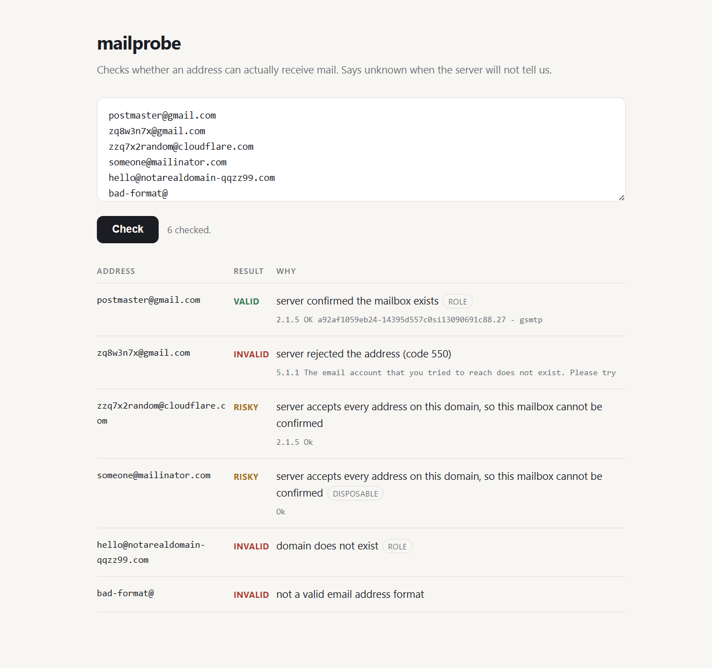
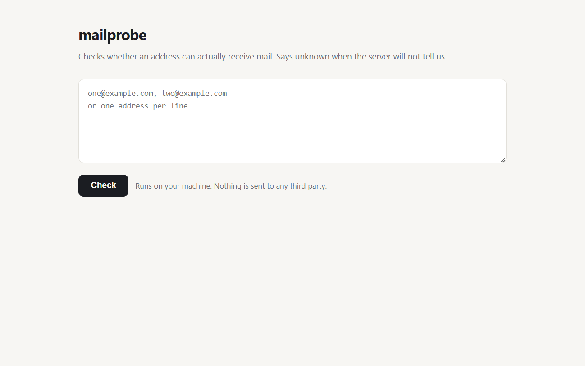

# mailprobe

[](https://github.com/bharathmay-boop/mailprobe/actions/workflows/test.yml)

Check whether an email address can actually receive mail, and say so plainly when that cannot be worked out.

## The problem

Most email checkers only look at the shape of an address. They see some text, an @ sign and a domain name, and call it valid. That test passes for addresses that will bounce the moment you send to them.

The checkers that go further run into a second problem. Many domains are set up to accept every address offered to them, which is called a catch-all. On those domains, asking whether a mailbox exists always comes back yes. A lot of tools take that yes at face value and report the address as valid.

These three addresses were made up on the spot. Every one of them is accepted by the receiving server:

```
$ mailprobe zzq7x2random@sendgrid.com,zzq7x2random@cloudflare.com,zzq7x2random@shopify.com

zzq7x2random@sendgrid.com    risky  server accepts every address on this domain, so this mailbox cannot be confirmed
zzq7x2random@cloudflare.com  risky  server accepts every address on this domain, so this mailbox cannot be confirmed
zzq7x2random@shopify.com     risky  server accepts every address on this domain, so this mailbox cannot be confirmed
```

A tool that calls those valid is not checking anything. It is guessing, and presenting the guess as a result.

<picture>
  <source media="(prefers-color-scheme: dark)" srcset="docs/results-dark.png">
  
</picture>

## What it checks

Four steps, stopping as soon as there is a clear answer.

1. **Shape.** Does the address follow the rules, including the length limits.
2. **Mail server.** Does the domain publish one. If it does not, mailprobe falls back to the domain itself, which the mail standard allows and many small domains rely on.
3. **Mailbox.** It starts a conversation with the mail server and asks about the address, then disconnects. No mail is ever sent.
4. **Catch-all.** Before asking about your address, it asks about a made up one that cannot exist. If the server accepts that, its answers carry no information, and your address is reported as risky rather than valid.

## What the results mean

| Result | Meaning |
|---|---|
| `valid` | The server confirmed this mailbox exists, and it does not accept every address. |
| `invalid` | The shape is wrong, the domain has no mail server, or the server turned the address down. |
| `risky` | It may work, but it cannot be confirmed. Catch-all domains and throwaway mail services land here. |
| `unknown` | The server would not answer. It asked us to come back later, hung up, or turned us away. |

`unknown` is there on purpose. A server that refuses to answer has told you nothing, and filing that as either valid or invalid throws away the fact that you still do not know. The most common case is a server replying "try again later" to any sender it has not seen before, which is a delaying tactic rather than a rejection.

Every result also carries `detail`, which is the mail server's own reply, so you can check the tool's reading against what was actually said.

Two extra labels appear next to the result. `role` marks addresses like support@ or info@ that usually reach a team rather than one person. `disposable` marks throwaway mail services. Neither is a problem on its own, so they are kept separate from the result and you decide what they mean for your use.

## Install

```bash
git clone https://github.com/bharathmay-boop/mailprobe.git
cd mailprobe
pip install .
```

Python 3.9 or newer. One dependency, dnspython, used to look up mail servers. Tested on 3.9, 3.11 and 3.13.

## Set your sending address

Before checking anything, tell mailprobe who to say it is. Mail servers ask, and the answer changes how they treat you.

```bash
export MAILPROBE_FROM="checks@yourdomain.com"
```

On Windows PowerShell:

```powershell
setx MAILPROBE_FROM "checks@yourdomain.com"
```

Use a domain you own. Nothing is sent from it and no mailbox needs to sit behind it, but the domain should be real, because the receiving server may look it up. You can also pass `--from-address` on a single run to override it.

Skip this and mailprobe falls back to `verify@example.com` and prints a reminder. That fallback works with some servers and is turned away by others, so results will be patchier. Silence the reminder with `--quiet` once you know the tradeoff.

## Use it

### In a browser

```bash
mailprobe --serve
```

This opens a page on your own machine. Paste in a list, press Check, and the results fill in below.



The page is tied to your machine only and cannot be reached from the rest of your network. It is built in, so there is nothing more to install. Use `--port` to pick a different port and `--no-browser` to stop it opening a window.

### From the command line

One address, or several separated by commas:

```bash
mailprobe someone@example.com
mailprobe "first@example.com,second@example.com"
```

Read a list from a file, one per line:

```bash
cat addresses.txt | mailprobe
```

Get JSON back for another program to read:

```bash
mailprobe --json someone@example.com
```

### From Python

```python
from mailprobe import verify

result = verify("someone@example.com")
print(result.status, result.reason)
```

## Options

| Option | Default | What it does |
|---|---|---|
| `--from-address` | `MAILPROBE_FROM`, else `verify@example.com` | Who we say we are. Use a domain you own. |
| `--timeout` | `10` | Seconds to wait for each step. Looking up the mail server and talking to it are separate steps, so one address can take up to twice this. |
| `--workers` | `5` | How many domains to check at the same time. |
| `--json` | off | Print results as JSON on standard output. Warnings go to standard error, so piping into a JSON reader stays clean. |
| `--serve` | off | Open the page on your machine. |
| `--port` | `8765` | Port for `--serve`. |
| `--no-browser` | off | With `--serve`, do not open a browser window. |
| `--quiet` | off | Do not print the reminder about the sending address. |
| `--version` | | Print the version and exit. |

The command exits with status 1 if any address came back invalid, and 0 otherwise, which is handy in scripts.

## How it handles a list

Addresses are grouped by domain first. Each domain gets one connection, and its addresses are checked one after another over that connection. Different domains are handled at the same time, up to `--workers`.

This matters for two reasons. Opening a separate connection for every address at the same company is the quickest way to get your IP address turned away. And when a domain turns out to be catch-all, mailprobe works that out once and marks every address on it as risky without asking about them one by one.

## What it can and cannot check

Measured by asking each provider about an address that exists and one that does not, from a home broadband connection. Your results will differ, and the next section explains why.

| Provider | What happens |
|---|---|
| Gmail, Proton, Zoho, Figma | Answers straight. Confirms real mailboxes, turns down made up ones. |
| Outlook, Hotmail, Yahoo, AOL, Apple | Hangs up. No answer is possible. |
| Google Workspace on a company domain, Stripe, SendGrid, Cloudflare, Shopify | Catch-all. Accepts everything, so nothing can be confirmed. |
| Microsoft 365, iCloud | Turned away the sender rather than the address. See below. |

The short version: business domains often answer, consumer mail from Microsoft, Yahoo and Apple mostly does not, and a fair share of company domains are catch-all. Any tool that reports confident results across all of these is not checking what it says it is checking.

## Where you run it changes the answers

Mail servers decide whether to talk to you based on where you are connecting from. Home and office connections sit on anti-spam lists as a matter of routine, because that is where hijacked machines tend to live. This is normal and does not mean anything is wrong with your connection.

When a server turns you away, it uses the same `550` reply it uses for a missing mailbox:

```
550 5.7.1 Service unavailable, Client host [203.0.113.10] blocked using Spamhaus
550 5.1.1 The email account that you tried to reach does not exist
```

The first is about you. The second is about the address. Reading only the `550` makes a working address look dead, which is how a list cleaner quietly deletes real customers.

mailprobe reads the second code, the `5.7.1` or `5.1.1` part, which the mail standard defines for this exact purpose. Anything in the `5.7` or `5.4` group is reported as `unknown` with an explanation, never as `invalid`. The server's own words are passed through in `detail` so you can see which list you are on and check it yourself.

In practice this means that from a listed connection you will see more `unknown` results and fewer confident ones. That is the tool working correctly. For answers on those domains you need to check from an address with a clean sending reputation, which usually means a mail server you already run.

## Other things worth knowing

**This runs on your machine, not on a server somewhere.** Checking a mailbox means connecting to the receiving mail server on port 25. Home and office connections normally allow that, so the tool works as soon as you install it. Hosting providers are the problem: AWS, Google Cloud, Azure, Vercel and most shared hosting block that port to limit spam, and on those every check comes back `unknown`. That is why there is no public demo link, and why the page runs on your own machine. If you do want it on a server, you need a host willing to unblock the port, which usually means asking support and explaining what you are doing.

**Go gently on volume.** Checking thousands of addresses from one IP address in a short space of time looks like spam, and servers will start refusing you. Lower `--workers` for long lists. The browser page caps a batch at 100 for this reason. The command line does not cap you, on the assumption that if you are scripting it you know what you are taking on.

**Existing is not the same as reaching the inbox.** This tells you a mailbox is there. It says nothing about whether your mail will be delivered, and it checks none of the settings that decide that.

**Addresses with non-English characters are turned down.** They are treated as bad shape rather than converted. If you need them, that conversion is the piece to add.

**The throwaway domain list is a starter set.** It covers the services that turn up most often. For fuller coverage, the [disposable-email-domains](https://github.com/disposable-email-domains/disposable-email-domains) project keeps a much longer list you can load in.

## Running the tests

```bash
python test_mailprobe.py
```

The tests cover the shape rules, how server replies turn into a result, the name we greet servers with, and the local page. None of them send traffic to a mail server, so they pass anywhere, including on build machines where port 25 is blocked.

They use plain asserts with no test framework, so there is nothing extra to install.

## Licence

MIT. See [LICENSE](LICENSE).
