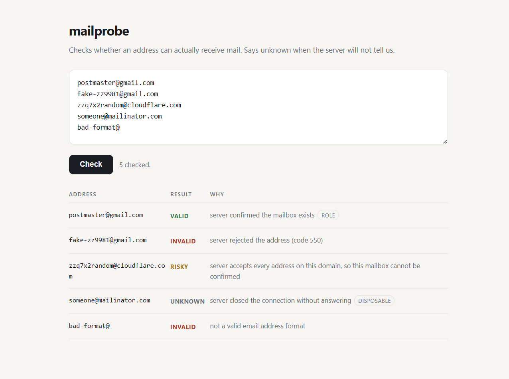

# mailprobe

[](https://github.com/bharathmay-boop/mailprobe/actions/workflows/test.yml)

Check whether an email address can actually receive mail, and say "unknown" when that cannot be determined.

## The problem

Most email checkers only look at the shape of the address. They confirm there is text, an @ sign, and a domain, then report the address as valid. That check passes for addresses that will bounce the moment you send to them.

The tools that go further have a second problem. Many domains are configured to accept every address offered to them, a setup called catch-all. On those domains, asking the mail server whether a mailbox exists always returns yes. Plenty of verifiers take that yes at face value and report the address as valid.

Here is what that looks like in practice. These three addresses are invented, and every one of them is accepted by the receiving server:

```
$ mailprobe zzq7x2random@sendgrid.com,zzq7x2random@cloudflare.com,zzq7x2random@shopify.com

zzq7x2random@sendgrid.com    risky  server accepts every address on this domain, so this mailbox cannot be confirmed
zzq7x2random@cloudflare.com  risky  server accepts every address on this domain, so this mailbox cannot be confirmed
zzq7x2random@shopify.com     risky  server accepts every address on this domain, so this mailbox cannot be confirmed
```

A checker that reports those as valid is not verifying anything. It is guessing, and passing the guess off as a result.

## What this does instead

mailprobe runs four checks in order and stops as soon as it has a definite answer.

1. Format. Does the address follow the rules for a real address, including the length limits.
2. Mail server. Does the domain publish a mail server. If there is no MX record it falls back to the domain's A record, which the mail standard allows and many small domains depend on.
3. Mailbox. It opens a conversation with the mail server and asks about the address, then disconnects. No mail is ever sent.
4. Catch-all. It asks the same server about a randomly generated address that cannot exist. If the server accepts that one too, the answer to question 3 was meaningless, and the result is reported as risky rather than valid.

## Results

| Status | Meaning |
|---|---|
| `valid` | The server confirmed this mailbox exists and does not accept every address. |
| `invalid` | The format is wrong, the domain has no mail server, or the server rejected the address outright. |
| `risky` | The address may work, but it cannot be confirmed. Catch-all domains and throwaway mail services land here. |
| `unknown` | The server would not answer. It asked us to retry later, hung up, or could not be reached. |

The `unknown` status is deliberate. A server that refuses to answer has told you nothing, and recording that as either valid or invalid loses information you might act on later. Temporary rejections are the common case here. Many servers reply "try again later" to any sender they have not seen before, which is a delay tactic, not a rejection.

Two extra flags are reported alongside the status. `role` marks addresses like support@ or info@ that usually reach a team rather than one person. `disposable` marks throwaway mail services. Neither is a failure on its own, so they are reported separately and you decide what they mean for your use.



## Install

```bash
git clone https://github.com/bharathmay-boop/mailprobe.git
cd mailprobe
pip install .
```

Python 3.9 or newer. The only dependency is dnspython, used for the mail server lookup. The tests run against 3.9, 3.11, and 3.13.

## Set your sending address first

Before checking anything, tell mailprobe who to say it is. Mail servers ask, and the answer changes how they treat you.

```bash
export MAILPROBE_FROM="checks@yourdomain.com"
```

Put that in your shell profile so it sticks. On Windows PowerShell:

```powershell
setx MAILPROBE_FROM "checks@yourdomain.com"
```

Use a domain you actually own. Nothing is sent from it and no mailbox needs to exist behind it, but the domain itself should be real, because the receiving server may check that it resolves. You can also pass `--from-address` on any single run, which overrides the variable.

If you skip this, mailprobe falls back to `verify@example.com` and prints a reminder. That fallback works against some servers and is refused by others, so results will be worse and less consistent. The reminder can be silenced with `--quiet` once you understand the tradeoff.

## Use

Check one address, or several separated by commas:

```bash
mailprobe someone@example.com
mailprobe "first@example.com,second@example.com"
```

Read a list from a file, one address per line:

```bash
cat addresses.txt | mailprobe
```

Get JSON back for use in another program:

```bash
mailprobe --json someone@example.com
```

From Python:

```python
from mailprobe import verify

result = verify("someone@example.com")
print(result.status, result.reason)
```

### In a browser

```bash
mailprobe --serve
```

This starts a small interface on your own machine and opens it, as shown in the picture above. Paste in a list, press Check, and the results appear in a table. Use `--port` to pick a different port, and `--no-browser` to stop it opening a window.

The interface is deliberately bound to localhost, so it is reachable from your machine only and not from the rest of your network. It is built into the tool and needs nothing beyond what the install already gave you.

### Options

| Option | Default | What it does |
|---|---|---|
| `--from-address` | `MAILPROBE_FROM`, else `verify@example.com` | The address used to introduce ourselves to the mail server. Set this to a domain you own. |
| `--timeout` | `10` | Seconds to wait for each step. The DNS lookup and the mail server conversation are separate steps, so a single address can take up to twice this. |
| `--workers` | `5` | How many domains to check at the same time. |
| `--json` | off | Print results as JSON, on standard output. Warnings go to standard error, so piping to a JSON reader stays clean. |
| `--serve` | off | Open the browser interface on this machine. |
| `--port` | `8765` | Port for `--serve`. |
| `--no-browser` | off | With `--serve`, do not open a browser window. |
| `--quiet` | off | Do not print the reminder about the sending address. |
| `--version` | | Print the version and exit. |

The command exits with status 1 if any address came back invalid, and 0 otherwise, which is useful in scripts.

## How it handles a list

Addresses are grouped by domain before anything happens. Each domain gets one connection, and the addresses on it are checked one after another over that connection. Domains are handled in parallel, up to `--workers`.

This matters for two reasons. Opening a separate connection for every address on the same domain is the fastest way to get your IP address refused. And when a domain turns out to be catch-all, mailprobe finds that out once and marks every address on it as risky without probing them individually.

## Things worth knowing before you rely on this

**This runs on your machine, not on a server somewhere.** Checking a mailbox means opening a connection to the receiving mail server on port 25. Home and office internet connections normally allow that, so the tool works as soon as you install it. Hosting providers are the problem: AWS, Google Cloud, Azure, Vercel, and most shared hosting block outbound port 25 by default to limit spam, and on those every check comes back `unknown`.

That is why there is no public demo link to click, and why the browser interface runs locally instead of being deployed. This is how mail works, not something the code can route around. If you do want it on a server, you need a host that will lift the port 25 block for you, which usually means asking support and explaining what you are doing.

**Set `MAILPROBE_FROM` to a domain you control.** Mail servers check who is asking, and mailprobe also uses that domain when it greets them. Leaving the default in place will get you turned away more often. See the section above.

**Go gently on volume.** Checking thousands of addresses from one IP address in a short window looks like the behaviour of a spammer, and mail servers will start refusing you. Lower `--workers` for large lists. The browser interface caps a single batch at 100 for this reason. The command line does not cap you, on the assumption that if you are scripting it you know what you are doing.

**Addresses with non-English characters are rejected.** Internationalised addresses and domains are treated as bad format rather than being converted. If you need them, that conversion is the piece to add.

**Large providers vary.** Gmail answers honestly about whether a mailbox exists. Some other large providers accept everything at this stage and reject later, which means an honest result for them is `risky`, not `valid`. That is the correct answer, not a gap.

**The throwaway domain list is a starter set.** It covers the services that show up most often. If you need full coverage, the [disposable-email-domains](https://github.com/disposable-email-domains/disposable-email-domains) project maintains a much longer list you can load in.

## Running the tests

```bash
python test_mailprobe.py
```

The tests cover address format rules, how server replies map to a status, the greeting name, and the local web interface. None of them send traffic to a mail server, so they pass anywhere, including on build machines where port 25 is blocked.

They run on plain asserts with no test framework, so there is nothing extra to install.

## Licence

MIT. See [LICENSE](LICENSE).
